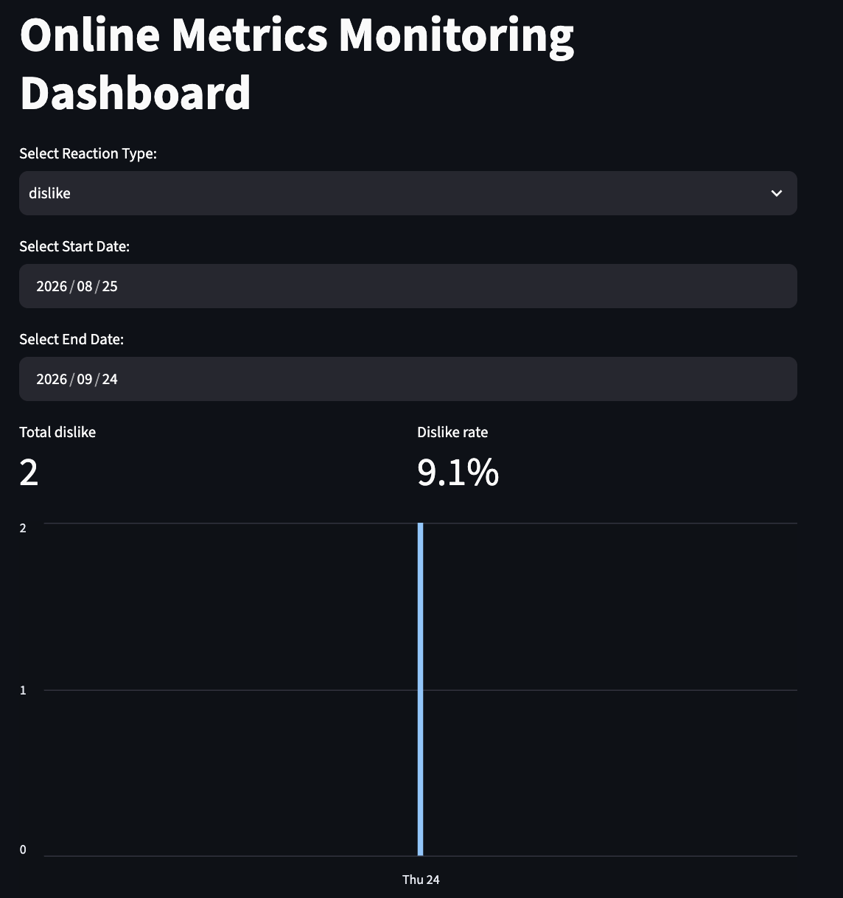
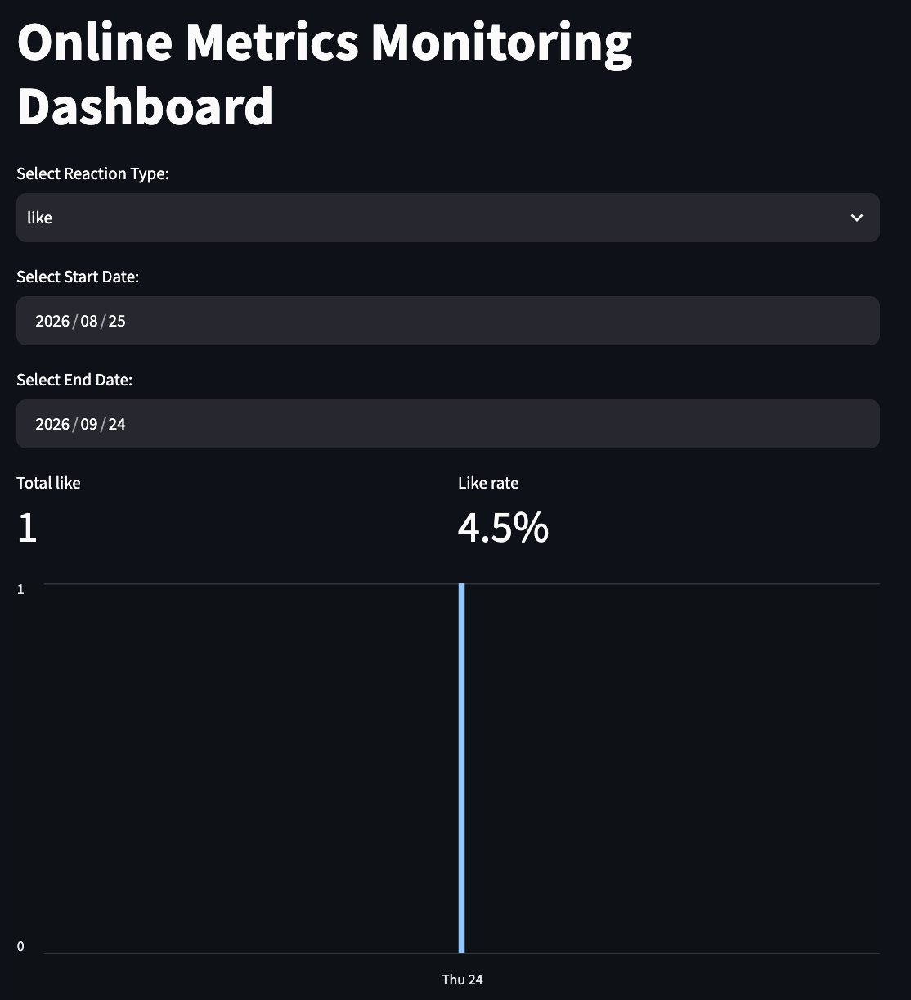
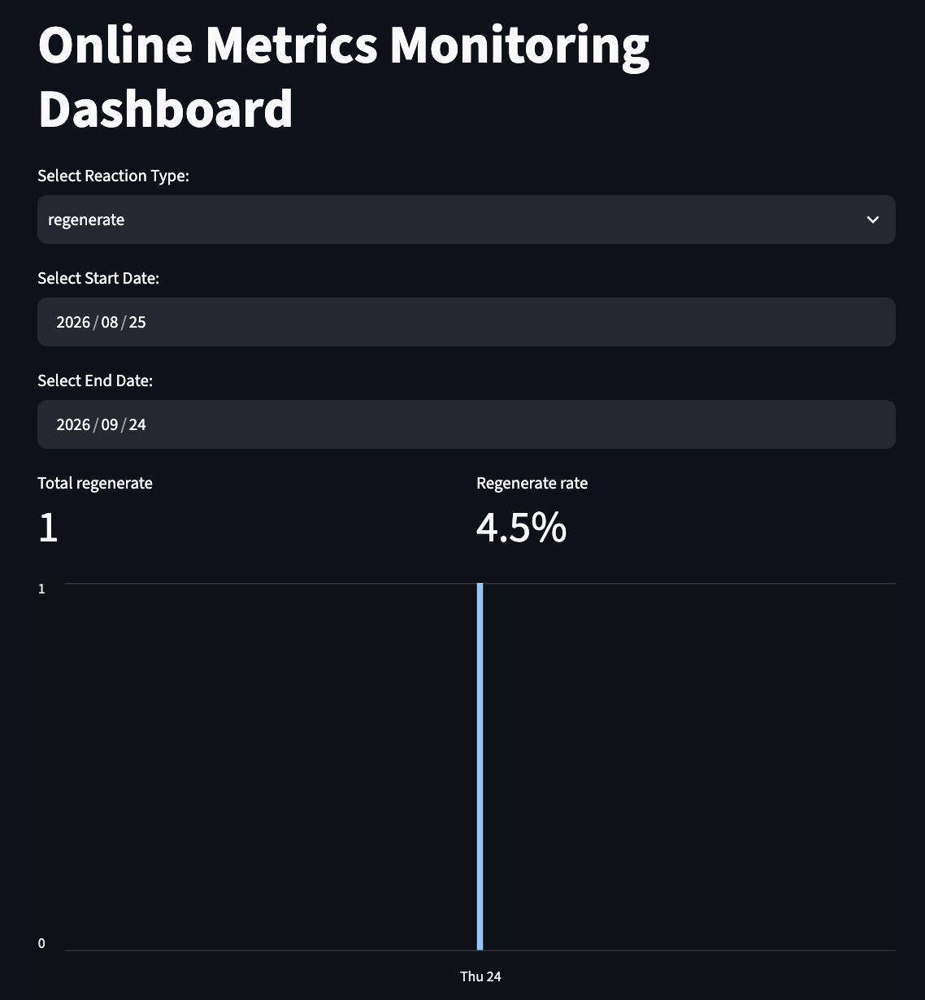

# LLM Evaluation: Offline Metrics & Online Metrics Dashboard

Dua notebook yang saling melengkapi soal evaluasi aplikasi LLM: satu
mengukur kualitas jawaban terhadap dataset tetap (**offline**), satu lagi
mengukur interaksi user sungguhan di layanan chat yang berjalan
(**online**). Berdua, keduanya menjawab pertanyaan yang sama dari dua
sudut: "apakah jawaban LLM ini bagus?"

| | Notebook | Yang diukur |
|---|---|---|
| Offline | `Offline_Evaluation_LLM.ipynb` | Exact match, F1 token-level, fuzzy similarity, BLEU, ROUGE, perplexity, semantic similarity |
| Online | `Online_Metrics_LLM_with_MySQL.ipynb` | Reaction rate (like/dislike/regenerate), latency, perilaku cache, tren harian |

Semua angka di README ini berasal dari hasil run notebook asli, bukan
perkiraan.

## Bagian 1 — Offline metrics

Satu dataset berisi 4 kasus (jawaban gold vs. prediksi model) dinilai oleh
semua metrik, dengan normalisasi teks yang konsisten di semua metrik --
jadi perbedaan angka antar metrik murni karena cara kerja metriknya
sendiri, bukan karena normalisasi yang beda-beda.

| Kasus | EM | F1 (token) | Fuzzy | BLEU | ROUGE-L | Cosine similarity |
|---|---|---|---|---|---|---|
| 1. Beda kapital saja | 1 | 1.000 | 97.0 | 1.000 | 1.000 | 0.998 |
| 2. Kata hilang + tambahan | 0 | 0.833 | 83.3 | 0.254 | 0.833 | 0.869 |
| 3. Parafrase (jawaban benar) | 0 | 0.727 | 44.7 | 0.103 | 0.545 | 0.993 |
| 4. Salah fakta (halusinasi) | 0 | 0.800 | 86.6 | 0.669 | 0.800 | 0.682 |

Kasus 3 dan 4 adalah pasangan yang menarik: jawaban yang *benar* tapi
beda kata (kasus 3) mendapat skor rendah di semua metrik leksikal (BLEU
0.103, ROUGE-L 0.545), sementara jawaban yang *salah fakta* tapi
kebetulan berbagi sebagian besar kata dengan gold (kasus 4) mendapat skor
yang menyesatkan tinggi (BLEU 0.669). Cosine similarity dari sentence
embedding membalik urutan itu (0.993 vs 0.682) -- ia menangkap makna dari
parafrase dan jauh lebih tidak mudah tertipu oleh kasus salah-fakta,
meski tetap bukan pengganti pengecekan fakta secara eksplisit.

**Perplexity** (GPT-2 versi Indonesia,
[`flax-community/gpt2-small-indonesian`](https://huggingface.co/flax-community/gpt2-small-indonesian),
bukan GPT-2 default yang berbahasa Inggris, supaya skornya mencerminkan
kalimatnya, bukan ketidakcocokan bahasa):

| Kalimat | Perplexity |
|---|---|
| "Jakarta adalah ibu kota Indonesia." | 17.29 |
| "Jakarta merupakan pusat pemerintaha Indonesia." (typo: *pemerintaha*) | 145.16 |

**Pencarian semantik** (sentence embedding multilingual + FAISS,
`IndexFlatIP` pada vektor ternormalisasi supaya hasilnya persis sama
dengan cosine similarity) berhasil mengurutkan "harga logam mulia hari
ini" paling dekat dengan "Harga emas hari ini mengalami kenaikan" (0.674)
dan "Emas Antam naik dua persen" (0.450), dan paling rendah untuk kalimat
tidak terkait "Nasabah dapat mengajukan pinjaman KCA" (-0.007).

## Bagian 2 — Dashboard online metrics

Layanan chat LLM lokal (FastAPI + llama.cpp) dengan cache jawaban berbasis
MySQL, feedback loop (like / dislike / regenerate), dan dashboard
Streamlit untuk reaction rate, latency per respons, dan tren harian --
jenis metrik yang cuma bisa dikumpulkan dari pemakaian sungguhan, bukan
dari dataset tetap.

- **Cache jawaban**: cache berbasis fuzzy matching (RapidFuzz) supaya
  pertanyaan yang diulang atau mirip bisa lewati inferensi.
- **Feedback loop**: reaksi `like` / `dislike` / `regenerate` dicatat per
  respons, dan `dislike` atau `regenerate` menghapus entri cache respons
  itu supaya tidak disajikan lagi.
- **Metrik, bukan cuma hitungan**: *rate* reaksi (reaksi ÷ total chat pada
  rentang waktu yang sama), bukan angka mentah, ditambah latency per
  respons.

### Arsitektur

```
+-------------+      like/dislike/regenerate      +--------------+
|  Streamlit  | ---------------------------------> |   FastAPI    |
|  dashboard  | <---- /total-reactions, dst. ------ |  (port 8000) |
+-------------+         (lewat localhost)           +------+-------+
       |                                                    |
   tunnel ngrok                                       llama-cpp-python
  (cuma dashboard,                                    (model GGUF lokal)
   akses publik)                                             |
                                                        +------v-------+
                                                        |    MySQL     |
                                                        | cached_chat  |
                                                        | chat_history |
                                                        |  analytics   |
                                                        +--------------+
```

Dashboard memanggil backend FastAPI lewat `localhost`, bukan lewat tunnel
publik kedua. Akun ngrok gratis, dari yang teruji, cuma mendukung 1
tunnel HTTP publik yang benar-benar aktif -- menjalankan dua tunnel
bersamaan (satu untuk API, satu untuk dashboard) membuat permintaan
nyasar diam-diam ke layanan yang salah. Menjaga trafik itu tetap di
localhost (kedua proses jalan di environment yang sama) menghindari
masalah itu sepenuhnya; tunnel publik cuma dibutuhkan untuk dashboard
supaya bisa dibuka dari luar environment tempatnya jalan.

### Model

[`gmonsoon/llama3-8b-cpt-sahabatai-v1-instruct-GGUF`](https://huggingface.co/gmonsoon/llama3-8b-cpt-sahabatai-v1-instruct-GGUF)
(kuantisasi Q4_K_M, ~4.9 GB) -- model Llama 3 8B Instruct yang di-continued
pretraining dan instruction-tuning untuk Bahasa Indonesia (plus Jawa,
Sunda, dan Inggris) oleh GoTo Group dan Indosat Ooredoo Hutchison, di
bawah Llama 3 Community License. Diunduh dari Hugging Face saat runtime,
tidak disertakan dalam repo ini.

### Setup

Butuh: Google Colab, database MySQL gratis dari
[freedb.tech](https://freedb.tech), dan akun [ngrok](https://ngrok.com)
gratis.

1. Buat database MySQL di freedb.tech dan catat host, port, nama
   database, username, dan password-nya.
2. Di Colab, tambahkan sebagai Secrets (ikon kunci di sidebar): `DB_HOST`,
   `DB_PORT`, `DB_NAME`, `DB_USER`, `DB_PASSWORD`, `NGROK_AUTHTOKEN`.
   Kalau ada secret yang belum di-set, otomatis muncul prompt `getpass`
   sebagai fallback.
3. Jalankan notebook dari atas ke bawah. Model diunduh sekali dan
   disimpan sebagai cache di Google Drive (antar sesi) sekaligus disk
   lokal Colab (membaca langsung dari mount Drive jauh lebih lambat
   dibanding disk lokal, karena `llama-cpp-python` membaca file dengan
   pola akses yang mahal lewat FUSE mount Drive).
4. Cell dashboard otomatis memutuskan tunnel publik milik API sebelum
   membuka tunnel dashboard (lihat Arsitektur di atas), lalu mencetak
   URL publik untuk dashboard Streamlit-nya.

### Hasil terverifikasi

22 respons chat tercatat pada run di bawah, mencakup satu pertanyaan yang
diulang ("Siapa presiden pertama Indonesia?"), satu pertanyaan lain yang
tidak terkait ("Siapa presiden ketiga Indonesia?"), dan masing-masing
satu reaksi `like`, dua `dislike`, dan satu `regenerate`.

| Jenis reaksi | Total | Rate (dari 22 chat) |
|---|---|---|
| Dislike | 2 | 9.1% |
| Like | 1 | 4.5% |
| Regenerate | 1 | 4.5% |

<p align="center">
  
  
  
</p>

**Invalidasi cache:** setelah reaksi `dislike` dan `regenerate` di atas,
entri cache terkait terkonfirmasi terhapus dari `cached_chat` --
pertanyaan yang sama yang ditanyakan lagi setelah reaksi negatif akan
kembali ke model, bukan mengulang jawaban yang sudah di-dislike.

**Threshold pencocokan cache:** cache fuzzy awalnya pakai threshold 80
dengan `fuzz.partial_ratio` milik RapidFuzz (pencocokan gaya substring),
yang memberi skor 88.2 untuk pertanyaan tidak terkait ("Siapa presiden
ketiga Indonesia?") terhadap entri cache "presiden pertama" -- cache hit
yang salah. Beralih ke `fuzz.ratio` (bandingkan keseluruhan string)
menurunkan skor pasangan yang sama jadi 85.7, masih di atas threshold 85,
jadi threshold dinaikkan ke 92.

**Keterbatasan yang disadari:** bahkan di 92, fuzzy matching berbasis
karakter tidak bisa diandalkan memisahkan dua pertanyaan yang cuma beda
satu angka pendek kalau sisa kalimatnya identik. Pasangan uji buatan --
"siapa presiden ke-2 di konoha" vs "siapa presiden ke-4 di konoha" --
mendapat skor sekitar 96.5 dengan `fuzz.ratio`, cukup dekat dengan skor
dua kalimat yang benar-benar identik (97-99) sehingga tidak ada satu
threshold yang bisa memisahkan keduanya dengan bersih. Threshold yang
lebih ketat mengurangi risiko ini tapi juga mengurangi seberapa sering
pertanyaan mirip yang genuine kena cache hit -- ini trade-off
precision/recall, bukan sesuatu yang bisa diselesaikan threshold saja.
Perbaikan yang lebih tepat (membandingkan entitas/angka kunci secara
eksplisit, atau pengecekan semantic similarity) menjadi pekerjaan
lanjutan.

## Lisensi

MIT -- lihat [LICENSE](LICENSE). Model yang dipakai didistribusikan
terpisah oleh pembuatnya masing-masing di bawah lisensinya sendiri (lihat
bagian Model di atas).
